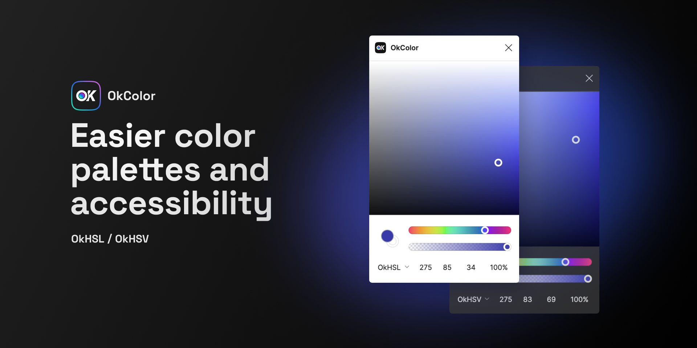

# OkColor

This is a plugin for Figma, [see its community page](https://www.figma.com/community/plugin/1173638098109123591/OkColor).

Check https://github.com/users/dokozero/projects/1, discussions, issues.

–

Picking color and creating balanced color palettes with Figma is not an easy task, HSL and HSB are not perceptually uniform, HSL's lightness is relative to the current hue, so for each of them, the real perceived 50% lightness is not at L 50.

Same problem with hue, if we make a palette from hue 0 to 70 with the same incremental value, we'll get a palette that is not perceptually progressive, some hue changes will seem bigger than others.

We also have a problem known as the “Abney effect”, mainly in the blue hues. If we take the hue 240, it shift from blue to purple when we update the lightness.

OkColor solves all these problems and more, its params are reliable and uniform, you know what you'll get.

If we change the hue of a color in OkLCH and keep the same lightness value, we know that the resulting color will have the same perceived lightness.

TODO - Update
You can also easily create perceptually uniform color palettes, and do more advanced things with OkLCH like picking colors in P3 space and use the relative chroma ([see this thread for more infos](https://twitter.com/dokozero/status/1711379022553272371)).

For more details, check [plugin community's page](https://www.figma.com/community/plugin/1173638098109123591/OkColor) for a FAQ and a playground file that explain in more details the plugin.

## Credits

This plugin is made possible by the [Culori JS library](https://culorijs.org/) and the creator of these color models: [Björn Ottosson](https://bottosson.github.io/).

The rendering of the color picker is done by [freydev](https://github.com/freydev) using WebGL shaders.

The APCA contrast feature is made possible by the work of [Myndex](https://www.myndex.com/APCA/) .

To know more about these uniform color spaces, you can check the original article from Björn Ottosson: [Oksvh and Okhsl](https://bottosson.github.io/posts/colorpicker/) and the one from oklch.com's creators: [OKLCH in CSS: why we moved from RGB and HSL](https://evilmartians.com/chronicles/oklch-in-css-why-quit-rgb-hsl).
